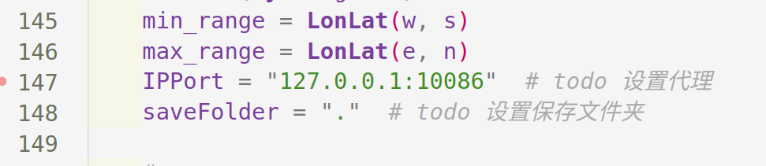
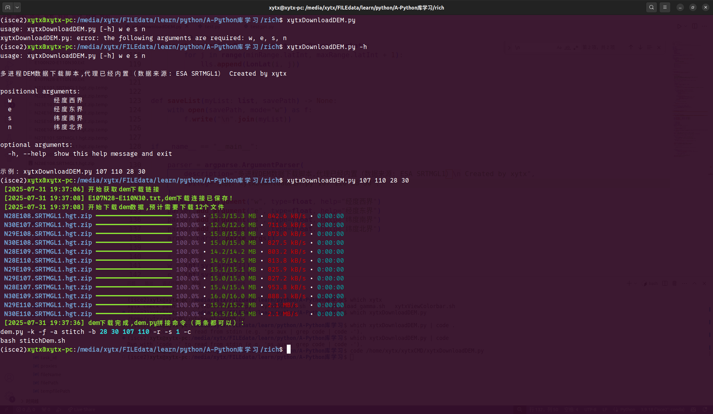

# 一个批量下载DEM数据的Python脚本

## 简介

本脚本主要是用于isce2做InSAR处理时的DEM下载拼接，也可以用作其他需要dem的生成需求。本脚本使用python编写，用于从[ESA SRTM](https://step.esa.int/auxdata/dem/SRTMGL1/)下载srtm30米的dem数据，dem数据格式为*.hgt。

脚本编写于Linux（Ubuntu22.04），目前Linux测试良好，理论上Windows和Mac也应该ok，有小伙伴愿意的话也可以帮忙测试反馈一下。

## 文件说明

```
.
├── batchDEMDL.py
├── batchDEMDownloaded.py
├── imgs
│   ├── 代理设置.png
│   └── 脚本使用截图.jpg
├── multiDEM.py
├── readme.md
├── test
│   ├── E110N21-E111N22.txt
│   ├── N21E110.SRTMGL1.hgt.zip
│   ├── N21E111.SRTMGL1.hgt.zip
│   ├── N22E110.SRTMGL1.hgt.zip
│   ├── N22E111.SRTMGL1.hgt.zip
│   └── stitchDem.sh
└── xytxDownloadDEM.py         
```

`batchDEMDownloaded.py`:最初版本，不具备下载功能
`batchDEMDL.py`:初步具备单一线程下载的功能
`xytxDownloadDEM.py`:当前版本，可以很方便的下载dem

脚本最初的执行方式一直是：拷贝脚本到文件夹 -> 修改脚本参数 -> 运行脚本，也就是multiDEM.py

但是用久了会感觉，很麻烦，尤其是偶尔还修改了mulitDEM.py的其他内容，但是拷贝时却拷贝的是另一个修改前的mulitDEM文件，于是有了第二种命令行版本。也就是xytxDownloadDEM.py。
xytxDownloadDEM.py的执行方式：脚本增加可执行权限且放置在环境变量下 -> 使用命令去下载。

## 安装

脚本的安装分两步：1.安装python依赖。2.配置环境变量

### 脚本依赖

脚本使用了python的requests库和rich库，所以要想使用脚本需要安装这两个库,可以使用pip install xxx安装这两个库。以下是笔者的版本,可供参考。

```
Python=3.9
requests=2.31.0
rich=14.1.0
```

### 添加脚本
复制xytxDownload.py到一个具有环境变量位置的地方，确保终端中能访问到即可。

对于Ubuntu而言，可以依次执行以下命令完成安装，该操作会在用户家目录下创建一个xxxcmd的文件夹，同时拷贝本脚本到该文件夹，最后将路径写入环境变量中。

```
mkdir -p ~/${USER}cmd
cp xytxDownloadDEM.py ~/${USER}cmd
echo "export PATH=~/${USER}cmd:${PATH}"> ~/.bashrc
```

### 配置代理

本脚本下载过程中，使用了代理，需要在脚本下图位置修改IPPort参数，具体IPPort获取可以参考[笔者下载哨兵数据的文章](https://github.com/cyloveyou/SentinelData_Download2023#%E8%AE%BE%E7%BD%AE%E6%9C%AC%E5%9C%B0%E4%BB%A3%E7%90%86)。

需要注意，如果不使用代理，只需要设置`IPPort=None`即可。



## 使用

以下为脚本使用截图，按照提示输入对应的经纬度边界即可下载。



脚本执行完毕后会在当前文件夹下生成如下文件：
```
.
├── E110N21-E111N22.txt         
├── N21E110.SRTMGL1.hgt.zip
├── N21E111.SRTMGL1.hgt.zip
├── N22E110.SRTMGL1.hgt.zip
├── N22E111.SRTMGL1.hgt.zip
└── stitchDem.sh
```

`E110N21-E111N22.txt`:存放dem下载链接，本脚本不灵时，也可以通过idm、wegt等下载工具下载，同时也可以根据文件名记录下载dem的范围。
`*.hgt.zip`:下载的dem数据
`stitchDem.sh`:isce2的dem.py拼接命令，可以直接用`bash stitchDem.sh`执行该脚本，拼接dem数据。

## 其他
有任何问题欢迎在笔者Github主页与笔者联系：[Gihtub](https://github.com/cyloveyou/)，也可以提交[issue](https://github.com/cyloveyou/BatchDownloadDEM/issues)。

也欢迎关注笔者的公众号和CSDN~
